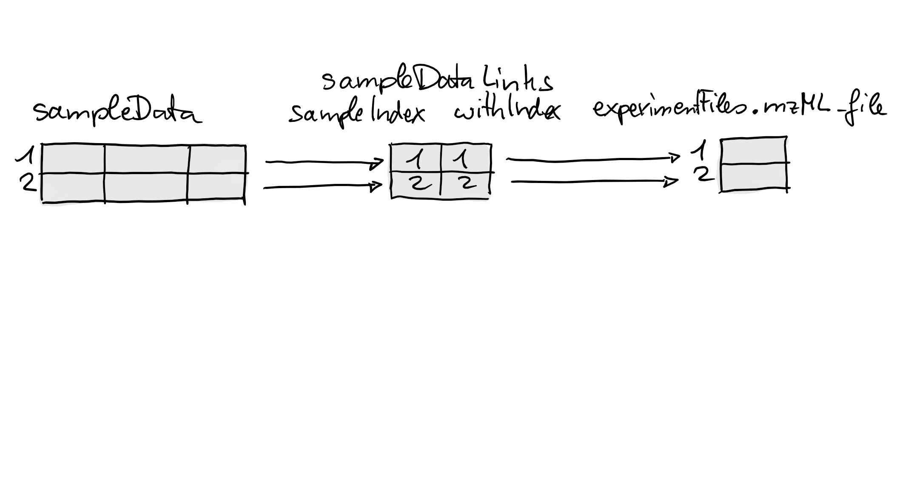
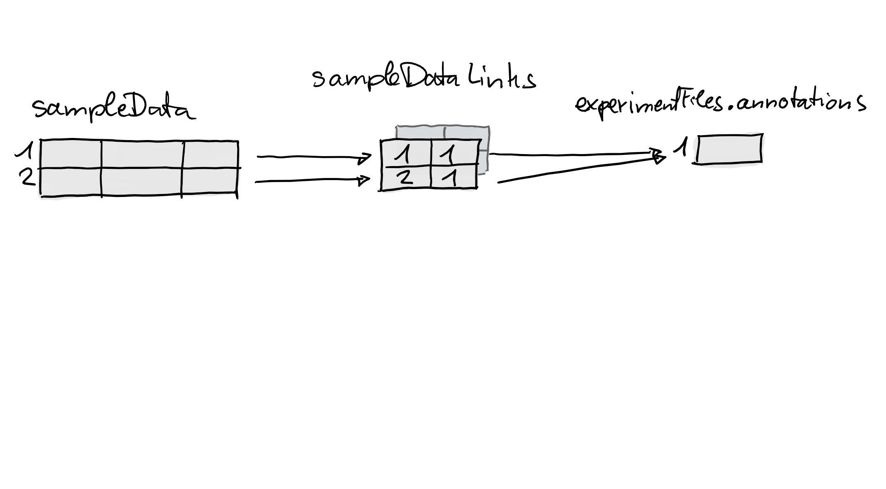
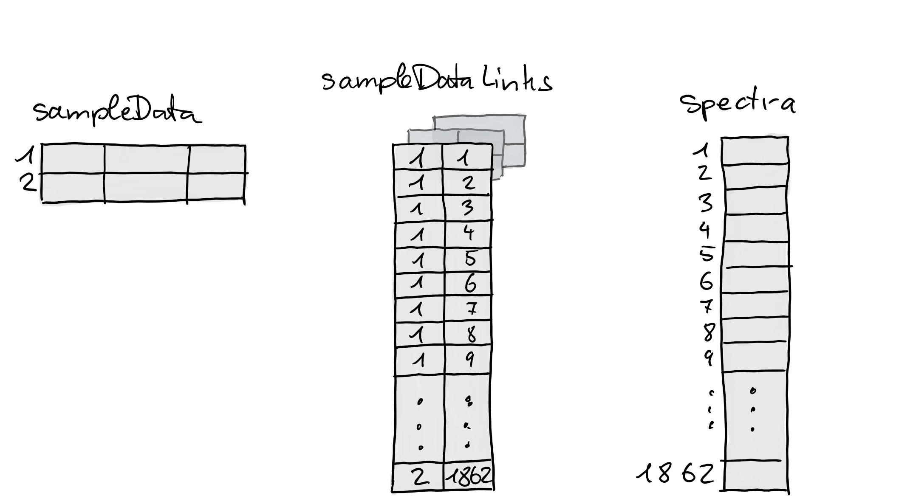

# Managing Mass Spectrometry Experiments

**Package**:
*[MsExperiment](https://bioconductor.org/packages/3.23/MsExperiment)*  
**Authors**: Laurent Gatto \[aut, cre\] (ORCID:
<https://orcid.org/0000-0002-1520-2268>), Johannes Rainer \[aut\]
(ORCID: <https://orcid.org/0000-0002-6977-7147>), Sebastian Gibb \[aut\]
(ORCID: <https://orcid.org/0000-0001-7406-4443>), Tuomas Borman \[ctb\]
(ORCID: <https://orcid.org/0000-0002-8563-8884>)  
**Last modified:** 2026-02-06 13:11:59.632198  
**Compiled**: Fri Feb 6 13:24:50 2026

## Introduction

The goal of the
*[MsExperiment](https://bioconductor.org/packages/3.23/MsExperiment)*
package is to provide a container for all data related to a mass
spectrometry (MS) experiment. Also other Bioconductor packages allow to
represent MS experiment data (such as the
*[MSnbase](https://bioconductor.org/packages/3.23/MSnbase)* package).
The `MsExperiment` however aims at being very light-weight and flexible
to accommodate all possible types of MS experiments (proteomics,
metabolomics, …) and all types of MS data representations
(chromatographic and spectral data, quantified features etc). In
addition, it allows to bundle additional files and data, such as
annotations, within the object.

In this vignette, we will describe how to create a `MsExperiment` object
and populate it with various types of data.

``` r

library("MsExperiment")
```

We will also use the
*[Spectra](https://bioconductor.org/packages/3.23/Spectra)* package to
import MS data and thus load it here too.

``` r

library("Spectra")
```

## Installation

The package can be installed with the
*[BiocManager](https://bioconductor.org/packages/3.23/BiocManager)*
package. To install `BiocManager` use `install.packages("BiocManager")`
and, after that, `BiocManager::install("MsExperiment")` to install
*[MsExperiment](https://bioconductor.org/packages/3.23/MsExperiment)*
which will install the package including all required dependencies.

## Getting data

We will use a small subset of the
[PXD022816](https://www.ebi.ac.uk/pride/archive/projects/PXD022816)
project ([Morgenstern et
al. (2020)](https://doi.org/10.1021/acs.jproteome.0c00956)). The
acquisitions correspond to a Pierce Thermo HeLa digestion standard,
diluted to 50ng/uL with 97:3 + 0.1% formic acid, and acquired on a
QExactive instrument.

Below, we use the *[rpx](https://bioconductor.org/packages/3.23/rpx)*
package to access the project from the PRIDE repository, and download
files of interest. Note that these will automatically be cached in the
`rpx` packages’ cache directory.

``` r

library("rpx")
px <- PXDataset("PXD022816")
```

    ## Loading PXD022816 from cache.

``` r

px
```

    ## Project PXD022816 with 32 files
    ## 

    ## Resource ID BFC1 in cache in /github/home/.cache/R/rpx.

    ##  [1] 'QEP2LC6_HeLa_50ng_251120_01-calib.mzID.gz' ... [32] 'checksum.txt'
    ##  Use 'pxfiles(.)' to see all files.

``` r

pxfiles(px)
```

    ## Project PXD022816 files (32):
    ##  [remote] QEP2LC6_HeLa_50ng_251120_01-calib.mzID.gz
    ##  [local]  QEP2LC6_HeLa_50ng_251120_01-calib.mzML
    ##  [remote] QEP2LC6_HeLa_50ng_251120_01.raw
    ##  [remote] QEP2LC6_HeLa_50ng_251120_02-calib.mzID.gz
    ##  [local]  QEP2LC6_HeLa_50ng_251120_02-calib.mzML
    ##  [remote] QEP2LC6_HeLa_50ng_251120_02.raw
    ##  [remote] QEP2LC6_HeLa_50ng_251120_03-calib.mzID.gz
    ##  [remote] QEP2LC6_HeLa_50ng_251120_03-calib.mzML
    ##  [remote] QEP2LC6_HeLa_50ng_251120_03.raw
    ##  [remote] QEP2LC6_HeLa_50ng_251120_04-calib.mzID.gz
    ##  ...

The project provides the vendor raw files, the converted mzML files as
well as the identification mzid files. Let’s download fractions 1 and 2
of the mzML files.

If you run these commands interactively and it’s the first time you use
[`pxget()`](https://rdrr.io/pkg/rpx/man/PXDataset2.html), you will be
asked to create the `rpx` cache directory - you can safelfy answer
*yes*. The files will then be downloaded. Next time you want to get the
same files, they will be loaded automatically from cache.

``` r

(i <- grep(".+0[12].+mzML$", pxfiles(px), value = TRUE))
```

    ## Project PXD022816 files (32):
    ##  [remote] QEP2LC6_HeLa_50ng_251120_01-calib.mzID.gz
    ##  [local]  QEP2LC6_HeLa_50ng_251120_01-calib.mzML
    ##  [remote] QEP2LC6_HeLa_50ng_251120_01.raw
    ##  [remote] QEP2LC6_HeLa_50ng_251120_02-calib.mzID.gz
    ##  [local]  QEP2LC6_HeLa_50ng_251120_02-calib.mzML
    ##  [remote] QEP2LC6_HeLa_50ng_251120_02.raw
    ##  [remote] QEP2LC6_HeLa_50ng_251120_03-calib.mzID.gz
    ##  [remote] QEP2LC6_HeLa_50ng_251120_03-calib.mzML
    ##  [remote] QEP2LC6_HeLa_50ng_251120_03.raw
    ##  [remote] QEP2LC6_HeLa_50ng_251120_04-calib.mzID.gz
    ##  ...

    ## [1] "QEP2LC6_HeLa_50ng_251120_01-calib.mzML"
    ## [2] "QEP2LC6_HeLa_50ng_251120_02-calib.mzML"

``` r

fls <- pxget(px, i)
```

    ## Loading QEP2LC6_HeLa_50ng_251120_01-calib.mzML from cache.

    ## Loading QEP2LC6_HeLa_50ng_251120_02-calib.mzML from cache.

``` r

fls
```

    ## [1] "/github/home/.cache/R/rpx/1739c1e6c38_QEP2LC6_HeLa_50ng_251120_01-calib.mzML" 
    ## [2] "/github/home/.cache/R/rpx/173927a78f33_QEP2LC6_HeLa_50ng_251120_02-calib.mzML"

## Mass spectrometry experiment

Let’s start by creating an empty `MsExperiment` object that we will
populate with different pieces of data as we proceed with the analysis
of our data.

``` r

msexp <- MsExperiment()
msexp
```

    ## Empty object of class MsExperiment

### Experiment files

Let’s now start with our MS experiment management by saving the relevant
files in a dedicated `MsExperimentFiles` object. In addition to the mzML
files, let’s also assume we have the human proteomics fasta file ready.
Later, when loading the raw data into R, we will refer directly to the
files in this `MsExperimentFiles` object.

``` r

msfls <- MsExperimentFiles(mzmls = fls,
                           fasta = "homo_sapiens.fasta")
msfls
```

    ## MsExperimentFiles of length  2 
    ## [["mzmls"]] 1739c1e6c38_QEP2LC6_HeLa_50ng_251120_01-calib.mzML ...
    ## [["fasta"]] homo_sapiens.fasta

Let’s add these files to the main experiment management object:

``` r

experimentFiles(msexp) <- msfls
msexp
```

    ## Object of class MsExperiment 
    ##  Files: mzmls, fasta

### Experimental design

The `sampleData` slot is used to describe the overall experimental
design of the experiment. It can be used to specify the samples of the
experiment and to relate them to the files that are part of the
experiment. There can be a one-to-one link between a sample and a file,
such as for example in label-free approaches, or one-to-many, in
labelled multiplexed approaches.

Here, we create a simple data frame with sample annotations that include
the original file names and the respective fractions.

``` r

sampleData(msexp) <- DataFrame(
    mzmls = basename(experimentFiles(msexp)[["mzmls"]]),
    fractions = 1:2)
sampleData(msexp)
```

    ## DataFrame with 2 rows and 2 columns
    ##           mzmls fractions
    ##     <character> <integer>
    ## 1 1739c1e6c3...         1
    ## 2 173927a78f...         2

### Raw data

We can now create a `Spectra` object containing the raw data stored in
the mzML files. If you are not familiar with the `Spectra` object,
please refer to the [package
vignettes](https://rformassspectrometry.github.io/Spectra/articles/Spectra.html).

``` r

sp <- Spectra(experimentFiles(msexp)[["mzmls"]])
sp
```

    ## MSn data (Spectra) with 58907 spectra in a MsBackendMzR backend:
    ##         msLevel     rtime scanIndex
    ##       <integer> <numeric> <integer>
    ## 1             1  0.177987         1
    ## 2             1  0.599870         2
    ## 3             1  0.978849         3
    ## 4             1  1.363217         4
    ## 5             1  1.742965         5
    ## ...         ...       ...       ...
    ## 58903         2   4198.59     29328
    ## 58904         1   4198.74     29329
    ## 58905         1   4199.11     29330
    ## 58906         1   4199.49     29331
    ## 58907         1   4199.87     29332
    ##  ... 34 more variables/columns.
    ## 
    ## file(s):
    ## 1739c1e6c38_QEP2LC6_HeLa_50ng_251120_01-calib.mzML
    ## 173927a78f33_QEP2LC6_HeLa_50ng_251120_02-calib.mzML

We can now add this object to the main experiment management object:

``` r

spectra(msexp) <- sp
msexp
```

    ## Object of class MsExperiment 
    ##  Files: mzmls, fasta 
    ##  Spectra: MS1 (12983) MS2 (45924) 
    ##  Experiment data: 2 sample(s)

### Third party applications

Let’s now assume we want to search the spectra in our mzML files against
the `homo_sapiens.fasta` file. To do so, we would like to use a search
engine such as MSGF+, that is run using the command line and generates
mzid files.

The command to run MSGF+ would look like this (see the [manual
page](https://msgfplus.github.io/msgfplus/MSGFPlus.html) for details):

    java -jar /path/to/MSGFPlus.jar \
         -s input.mzML \
         -o output.mzid
         -d proteins.fasta \
         -t 20ppm \ ## precursor mass tolerance
         -tda 1 \   ## search decoy database
         -m 0 \     ## fragmentation method as written in the spectrum or CID if no info
         -int 1     ## Orbitrap/FTICR/Lumos

We can easily build such a command for each of our input file:

``` r

mzids <- sub("mzML", "mzid", basename(experimentFiles(msexp)[["mzmls"]]))
paste0("java -jar /path/to/MSGFPlus.jar",
       " -s ", experimentFiles(msexp)[["mzmls"]],
       " -o ", mzids,
       " -d ", experimentFiles(msexp)[["fasta"]],
       " -t 20ppm",
       " -m 0",
       " int 1")
```

    ## [1] "java -jar /path/to/MSGFPlus.jar -s /github/home/.cache/R/rpx/1739c1e6c38_QEP2LC6_HeLa_50ng_251120_01-calib.mzML -o 1739c1e6c38_QEP2LC6_HeLa_50ng_251120_01-calib.mzid -d homo_sapiens.fasta -t 20ppm -m 0 int 1"  
    ## [2] "java -jar /path/to/MSGFPlus.jar -s /github/home/.cache/R/rpx/173927a78f33_QEP2LC6_HeLa_50ng_251120_02-calib.mzML -o 173927a78f33_QEP2LC6_HeLa_50ng_251120_02-calib.mzid -d homo_sapiens.fasta -t 20ppm -m 0 int 1"

Here, for the sake of time and portability, we will not actually run
MSGF+, but a simple shell script that will generate mzid files in a
temporary R directory.

``` r

(output <- file.path(tempdir(), mzids))
```

    ## [1] "/tmp/Rtmpen8GTM/1739c1e6c38_QEP2LC6_HeLa_50ng_251120_01-calib.mzid" 
    ## [2] "/tmp/Rtmpen8GTM/173927a78f33_QEP2LC6_HeLa_50ng_251120_02-calib.mzid"

``` r

cmd <- paste("touch", output)
cmd
```

    ## [1] "touch /tmp/Rtmpen8GTM/1739c1e6c38_QEP2LC6_HeLa_50ng_251120_01-calib.mzid" 
    ## [2] "touch /tmp/Rtmpen8GTM/173927a78f33_QEP2LC6_HeLa_50ng_251120_02-calib.mzid"

The `cmd` variable holds the two commands to be run on the command line
that will generate the new files. We can run each of these commands with
the [`system()`](https://rdrr.io/r/base/system.html) function.

``` r

sapply(cmd, system)
```

    ##  touch /tmp/Rtmpen8GTM/1739c1e6c38_QEP2LC6_HeLa_50ng_251120_01-calib.mzid 
    ##                                                                         0 
    ## touch /tmp/Rtmpen8GTM/173927a78f33_QEP2LC6_HeLa_50ng_251120_02-calib.mzid 
    ##                                                                         0

Below, we add the names of the newly created files to our experiment:

``` r

experimentFiles(msexp)[["mzids"]] <- mzids
experimentFiles(msexp)
```

    ## MsExperimentFiles of length  3 
    ## [["mzmls"]] 1739c1e6c38_QEP2LC6_HeLa_50ng_251120_01-calib.mzML ...
    ## [["fasta"]] homo_sapiens.fasta
    ## [["mzids"]] 1739c1e6c38_QEP2LC6_HeLa_50ng_251120_01-calib.mzid ...

``` r

msexp
```

    ## Object of class MsExperiment 
    ##  Files: mzmls, fasta, mzids 
    ##  Spectra: MS1 (12983) MS2 (45924) 
    ##  Experiment data: 2 sample(s)

We can also decide to store the commands that were used to generate the
mzid files in the experiment’s metadata slot. Here, we use the
convention to name that metadata item `"mzmls_to_mzids"` to document to
input and output of these commands.

``` r

metadata(msexp)[["mzmls_to_mzids"]] <- cmd
metadata(msexp)
```

    ## $mzmls_to_mzids
    ## [1] "touch /tmp/Rtmpen8GTM/1739c1e6c38_QEP2LC6_HeLa_50ng_251120_01-calib.mzid" 
    ## [2] "touch /tmp/Rtmpen8GTM/173927a78f33_QEP2LC6_HeLa_50ng_251120_02-calib.mzid"

Finally, the
[`existMsExperimentFiles()`](https://rformassspectrometry.github.io/MsExperiment/reference/MsExperimentFiles.md)
can be used at any time to check which of files that are associated with
an experiment actually exist:

``` r

existMsExperimentFiles(msexp)
```

    ## mzmls: 2 out of 2 exist(s)
    ## fasta: 0 out of 1 exist(s)
    ## mzids: 0 out of 2 exist(s)

## Saving and reusing experiments

The `MsExperiment` object has been used to store files and data
pertaining to a mass spectrometry experiment. It is now possible to save
that object and reload it later to recover all data and metadata. See
also section *Using `MsExperiment` with `MsBackendSql`* below for an
alternative to load/restore defined MS experiments from an SQL database.

``` r

saveRDS(msexp, "msexp.rds")
rm(list = ls())
```

``` r

msexp <- readRDS("msexp.rds")
msexp
```

    ## Object of class MsExperiment 
    ##  Files: mzmls, fasta, mzids 
    ##  Spectra: MS1 (12983) MS2 (45924) 
    ##  Experiment data: 2 sample(s)

``` r

experimentFiles(msexp)
```

    ## MsExperimentFiles of length  3 
    ## [["mzmls"]] 1739c1e6c38_QEP2LC6_HeLa_50ng_251120_01-calib.mzML ...
    ## [["fasta"]] homo_sapiens.fasta
    ## [["mzids"]] 1739c1e6c38_QEP2LC6_HeLa_50ng_251120_01-calib.mzid ...

We can access the raw data as long as the mzML files that were used to
generate it still exist in their original location, which is the case
here as they were saved in the `rpx` cache directory.

``` r

sp <- spectra(msexp)
sp
```

    ## MSn data (Spectra) with 58907 spectra in a MsBackendMzR backend:
    ##         msLevel     rtime scanIndex
    ##       <integer> <numeric> <integer>
    ## 1             1  0.177987         1
    ## 2             1  0.599870         2
    ## 3             1  0.978849         3
    ## 4             1  1.363217         4
    ## 5             1  1.742965         5
    ## ...         ...       ...       ...
    ## 58903         2   4198.59     29328
    ## 58904         1   4198.74     29329
    ## 58905         1   4199.11     29330
    ## 58906         1   4199.49     29331
    ## 58907         1   4199.87     29332
    ##  ... 34 more variables/columns.
    ## 
    ## file(s):
    ## 1739c1e6c38_QEP2LC6_HeLa_50ng_251120_01-calib.mzML
    ## 173927a78f33_QEP2LC6_HeLa_50ng_251120_02-calib.mzML

``` r

plotSpectra(sp[1000])
```


## Linking experimental data to samples

For some experiments and data analyses an explicit link between data,
data files and respective samples is required. Such links enable an easy
(and error-free) subset or re-ordering of a whole experiment by sample
and would also simplify coloring and labeling of the data depending on
the sample or of its variables or conditions.

Below we generate an `MsExperiment` object for a simple experiment
consisting of a single sample measured in two different injections to
the same LC-MS setup.

``` r

lmse <- MsExperiment()
sd <- DataFrame(sample_id = c("QC1", "QC2"),
                sample_name = c("QC Pool", "QC Pool"),
                injection_idx = c(1, 3))
sampleData(lmse) <- sd
```

We next add mzML files to the experiment for the sample that was
measured. These are available through Bioconductor’s *MsDataHub*. We add
also an additional *annotation* file `"internal_standards.txt"` to the
experiment, which could be e.g. a file with m/z and retention times of
internal standards added to the sample (note that such files don’t
necessarily have to exist).

``` r

library(MsDataHub)
fls <- c(MsDataHub::X20171016_POOL_POS_1_105.134.mzML(),
         MsDataHub::X20171016_POOL_POS_3_105.134.mzML())
```

    ## see ?MsDataHub and browseVignettes('MsDataHub') for documentation

    ## loading from cache

    ## see ?MsDataHub and browseVignettes('MsDataHub') for documentation

    ## loading from cache

``` r

basename(fls)
```

    ## [1] "173941d49f52_7859" "17391674d18a_7860"

``` r

experimentFiles(lmse) <- MsExperimentFiles(
    mzML_files = fls,
    annotations = "internal_standards.txt")
```

Next we load the MS data from the mzML files as a `Spectra` object and
add them to the experiment (see the vignette of the
*[Spectra](https://bioconductor.org/packages/3.23/Spectra)* for details
on import and representation of MS data).

``` r

sps <- Spectra(fls, backend = MsBackendMzR())
spectra(lmse) <- sps
lmse
```

    ## Object of class MsExperiment 
    ##  Files: mzML_files, annotations 
    ##  Spectra: MS1 (1862) 
    ##  Experiment data: 2 sample(s)

At this stage we have thus sample annotations and MS data in our object,
but no explicit relationships between them. Without such linking between
files and samples any subsetting would only subset the `sampleData` but
not any of the potentially associated files. We next use the
`linkSpectraData()` function to establish and define such relationships.
First we link the experimental files to the samples: we want to link the
first mzML file in the element called `"mzML_file"` in the object’s
`experimentFiles` to the first row in `sampleData` and the second file
to the second row.

``` r

lmse <- linkSampleData(lmse, with = "experimentFiles.mzML_file",
                        sampleIndex = c(1, 2), withIndex = c(1, 2))
```

To define the link we have thus to specify with which *element* within
our `MsExperiment` we want to link samples. This can be done with the
parameter `with` that takes a single `character` representing the name
(*address*) of the data element. The name is a combination of the name
of the slot within the `MsExperiment` and the name of the element (or
column) within that slot separated by a `"."`. Using
`with = "experimentFiles.mzML_file"` means we want to link samples to
values within the `"mzML_file"` element of the object’s
`experimentFiles` slot - in other words, we want to link samples to
values in `experimentFiles(lmse)$mzML_file`. The indices of the rows
(samples) in `sampleData` and the indices of the values in `with` to
which we want to link the samples can be defined with `sampleIndex` and
`withIndex`. In the example above we used `sampleIndex = c(1, 2)` and
`withIndex = c(1, 2)`, thus, we want to link the first row in
`sampleData` to the first value in `with` and the second row to the
second value. See also the section *Linking sample data to other
experimental data* in the documentation of `MsExperiment` for more
information and details.

What happened internally by the call above is illustrated in the figure
below. The link is represented as a two-column integer `matrix` with the
indices of the linked sample in the first and the indices of the
associated elements in the second columns (this matrix is essentially a
`cbind(sampleIndex, withIndex)`).



We next establish a second link between each sample and the *annotation*
file `"internal_standards.txt"` in `experimentFiles(lmse)$standards`:

``` r

lmse <- linkSampleData(lmse, with = "experimentFiles.annotations",
                        sampleIndex = c(1, 2), withIndex = c(1, 1))
```

The figure below illustrates again what happened internally by this
call: a new *link matrix* was added establishing the relationship
between the two samples and the one value in
`experimentFiles(lmse)$annotations`.



It is thus also possible to link different samples to the same element.
We next link the spectra in the object to the individual samples. We use
for that an alternative way to specify the link without the need to
provide `sampleIndex` and `withIndex`. Sample-to-data links can also be
specified using a syntax similar to an SQL join:
`"sampleData.<column in sampleData> = <slot>.<element in slot>"`. Links
will be thus established between elements with matching values in the
specified data fields (i.e. between rows in `sampleData` for which
values in the specified column matches values in `<slot>.<element>`). In
order to use this alternative approach to link spectra to the respective
samples we have to first add the (full) raw file name as an additional
column to the object’s `sampleData`. We can now add links between
spectra and samples by matching this raw file name to the original file
name from which the spectra were imported (which is available in the
`"dataOrigin"` spectra variable).

``` r

sampleData(lmse)$raw_file <- normalizePath(fls)
lmse <- linkSampleData(
    lmse, with = "sampleData.raw_file = spectra.dataOrigin")
```

The link was thus established between matching values in
`sampleData(lmse)$raw_file` and `spectra(lmse)$dataOrigin`.

``` r

sampleData(lmse)$raw_file
```

    ## [1] "/github/home/.cache/R/ExperimentHub/173941d49f52_7859"
    ## [2] "/github/home/.cache/R/ExperimentHub/17391674d18a_7860"

``` r

spectra(lmse)$dataOrigin |>
                head()
```

    ## [1] "/github/home/.cache/R/ExperimentHub/173941d49f52_7859"
    ## [2] "/github/home/.cache/R/ExperimentHub/173941d49f52_7859"
    ## [3] "/github/home/.cache/R/ExperimentHub/173941d49f52_7859"
    ## [4] "/github/home/.cache/R/ExperimentHub/173941d49f52_7859"
    ## [5] "/github/home/.cache/R/ExperimentHub/173941d49f52_7859"
    ## [6] "/github/home/.cache/R/ExperimentHub/173941d49f52_7859"

The figure below illustrates this link. With that last call we have thus
established links between samples and 3 different data elements in the
`MsExperiment`.



``` r

lmse
```

    ## Object of class MsExperiment 
    ##  Files: mzML_files, annotations 
    ##  Spectra: MS1 (1862) 
    ##  Experiment data: 2 sample(s)
    ##  Sample data links:
    ##   - experimentFiles.mzML_file: 2 sample(s) to 2 element(s).
    ##   - experimentFiles.annotations: 2 sample(s) to 1 element(s).
    ##   - spectra: 2 sample(s) to 1862 element(s).

A convenience function to quickly extract the index of a sample a
spectrum is associated with is
[`spectraSampleIndex()`](https://rformassspectrometry.github.io/MsExperiment/reference/MsExperiment.md).
This function returns an `integer` vector of length equal to the number
of spectra in the object with the row in the object’s `sampleData` a
spectrum is linked to, or `NA_integer_` if a spectrum is not linked to
any sample.

``` r

#' Show the sample assignment for the first few spectra
spectraSampleIndex(lmse) |>
    head()
```

    ## [1] 1 1 1 1 1 1

If we had also quantified *feature* values, we could also link them to
the samples. Below we create a simple, small `SummarizedExperiment` to
represent such quantified feature values and add that to our experiment.
To show that `MsExperiment` supports also links between subsets of data
elements, we create a `SummarizedExperiment` that contains values for an
additional sample which is not present in our `sampleData`. Also, we add
samples in an arbitrary order.

``` r

library(SummarizedExperiment)
sd <- DataFrame(sample = c("QC2", "QC1", "QC3"), idx = c(3, 1, 5))
se <- SummarizedExperiment(colData = sd, assay = cbind(1:10, 11:20, 21:30))

qdata(lmse) <- se
```

Next we link the samples in this `SummarizedExperiment` to the samples
to in the `MsExperiment` using matching values between the `"sample_id"`
column in the object’s `sampleData` data frame and the column `"sample"`
in the `SummarizedExperiment`’s `colData` which is stored in the
`@qdata` slot. The naming convention to define such columns is
`<slot name>.<column name>`.

``` r

sampleData(lmse)$sample_id
```

    ## [1] "QC1" "QC2"

``` r

qdata(lmse)$sample
```

    ## [1] "QC2" "QC1" "QC3"

``` r

lmse <- linkSampleData(lmse, with = "sampleData.sample_id = qdata.sample")
lmse
```

    ## Object of class MsExperiment 
    ##  Files: mzML_files, annotations 
    ##  Spectra: MS1 (1862) 
    ##  SummarizedExperiment: 10 feature(s)
    ##  Experiment data: 2 sample(s)
    ##  Sample data links:
    ##   - experimentFiles.mzML_file: 2 sample(s) to 2 element(s).
    ##   - experimentFiles.annotations: 2 sample(s) to 1 element(s).
    ##   - spectra: 2 sample(s) to 1862 element(s).
    ##   - qdata: 2 sample(s) to 2 column(s).

The main advantage of all these links is that any subsetting of the
experiment by sample will keep the (linked) data consistent. To
illustrate this we subset below the experiment to the second sample.

``` r

b <- lmse[2]
b
```

    ## Object of class MsExperiment 
    ##  Files: mzML_files, annotations, mzML_file 
    ##  Spectra: MS1 (931) 
    ##  SummarizedExperiment: 10 feature(s)
    ##  Experiment data: 1 sample(s)
    ##  Sample data links:
    ##   - experimentFiles.mzML_file: 1 sample(s) to 1 element(s).
    ##   - experimentFiles.annotations: 1 sample(s) to 1 element(s).
    ##   - spectra: 1 sample(s) to 931 element(s).
    ##   - qdata: 1 sample(s) to 1 column(s).

The subset object contains now all data elements that are linked to this
second sample. Accessing the `assay` of the `SummarizedExperiment` in
`qdata` will thus return only the quantified feature abundances for this
second sample.

``` r

assay(qdata(b))
```

    ##       [,1]
    ##  [1,]    1
    ##  [2,]    2
    ##  [3,]    3
    ##  [4,]    4
    ##  [5,]    5
    ##  [6,]    6
    ##  [7,]    7
    ##  [8,]    8
    ##  [9,]    9
    ## [10,]   10

But what happens for data elements that are not linked to any sample?
Below we add a `data.frame` as a `metadata` to the experiment and subset
the object again.

``` r

metadata(lmse)$other <- data.frame(
                  sample_name = c("study_1", "POOL", "study_2"),
                  index = 1:3)
b <- lmse[2]
metadata(b)
```

    ## $other
    ##   sample_name index
    ## 1     study_1     1
    ## 2        POOL     2
    ## 3     study_2     3

By default, any element which is **not** linked to a sample is retained
in the filtered/subset object.

We next link each sample to the second row in this data frame and subset
the data again to the second sample.

``` r

lmse <- linkSampleData(lmse, with = "metadata.other",
                      sampleIndex = 1:2, withIndex = c(2, 2))
b <- lmse[2]
metadata(b)
```

    ## $other
    ##   sample_name index
    ## 2        POOL     2

Subsetting thus retained only the row in the data frame for the linked
sample. Obviously it is also possible to subset to multiple samples, in
arbitrary order. Below we re-order our experiment.

``` r

lmse <- lmse[c(2, 1)]
sampleData(lmse)
```

    ## DataFrame with 2 rows and 4 columns
    ##     sample_id sample_name injection_idx      raw_file
    ##   <character> <character>     <numeric>   <character>
    ## 1         QC2     QC Pool             3 /github/ho...
    ## 2         QC1     QC Pool             1 /github/ho...

The sample order is thus reversed and also all other linked elements are
re-ordered accordingly, such as `"mzML_file"` in the object’s
`experimentFiles`.

``` r

experimentFiles(lmse)$mzML_file
```

    ##                                                  EH7810 
    ## "/github/home/.cache/R/ExperimentHub/17391674d18a_7860" 
    ##                                                  EH7809 
    ## "/github/home/.cache/R/ExperimentHub/173941d49f52_7859"

It is however important to note, that subsetting will also *duplicate*
elements that are associated with multiple samples:

``` r

experimentFiles(lmse)$annotations
```

    ## [1] "internal_standards.txt" "internal_standards.txt"

Thus, while we added a single *annotation* file to the data element
`"annotations"` in `experimentFiles`, after subsetting we ended up with
two identical files. This duplication of *n:m* relationships between
samples to elements does however not affect data consistency. A sample
will always be linked to the correct value/element.

## Subset and filter `MsExperiment`

As already shown above, `MsExperiment` objects can be subset with `[`
which will subset the data by sample. Depending on whether relationships
(links) between samples and any other data within the object are present
also these are correctly subset. In addition to this general subset
operation, it is possible to individually filter the spectra data within
an `MsExperiment` using the `filterSpectra` function. This function
takes any filter function supported by `Spectra` with parameter
`filter`. Parameters for this filter function can be passed through
`...`. As an example we filter below the spectra data of our
`MsExperiment` keeping only spectra with an retention time between 200
and 210 seconds.

``` r

#' Filter the Spectra using the `filterRt` function providing also the
#' parameters for this function.
res <- filterSpectra(lmse, filterRt, rt = c(200, 210))
res
```

    ## Object of class MsExperiment 
    ##  Files: mzML_files, annotations, mzML_file 
    ##  Spectra: MS1 (72) 
    ##  SummarizedExperiment: 10 feature(s)
    ##  Experiment data: 2 sample(s)
    ##  Sample data links:
    ##   - experimentFiles.mzML_file: 2 sample(s) to 2 element(s).
    ##   - experimentFiles.annotations: 2 sample(s) to 2 element(s).
    ##   - spectra: 2 sample(s) to 72 element(s).
    ##   - qdata: 2 sample(s) to 2 column(s).
    ##   - metadata.other: 2 sample(s) to 2 element(s).

The resulting `MsExperiment` contains now much fewer spectra.
`filterSpectra` did only filter the spectra data, but not any of the
other data slots. It did however update and consolidate the
relationships between samples and spectra (if present) after filtering:

``` r

#' Extract spectra of the second sample after filtering
spectra(res[2L])
```

    ## MSn data (Spectra) with 36 spectra in a MsBackendMzR backend:
    ##       msLevel     rtime scanIndex
    ##     <integer> <numeric> <integer>
    ## 1           1   200.049       717
    ## 2           1   200.328       718
    ## 3           1   200.607       719
    ## 4           1   200.886       720
    ## 5           1   201.165       721
    ## ...       ...       ...       ...
    ## 32          1   208.698       748
    ## 33          1   208.977       749
    ## 34          1   209.256       750
    ## 35          1   209.535       751
    ## 36          1   209.814       752
    ##  ... 34 more variables/columns.
    ## 
    ## file(s):
    ## 173941d49f52_7859
    ## Processing:
    ##  Filter: select retention time [200..210] on MS level(s)  [Fri Feb  6 13:25:12 2026]

## Using `MsExperiment` with `MsBackendSql`

The
*[MsBackendSql](https://bioconductor.org/packages/3.23/MsBackendSql)*
provides functionality to store mass spectrometry data in a SQL database
and to *represent* such data as a `Spectra` object (through its
`MsBackendSql` or `MsBackendOfflineSql` backends). Next to the MS data,
it is also possible to store sample data in such SQL databases hence
allowing to create self-contained databases for MS experiments. This
simplifies the process to load pre-defined MS experiment or to share
experiment data across analyses or with a collaborator. In this section
we show how MS data and sample information from an experiment can be
stored into a SQL database and how that data can then be loaded again as
a `MsExperiment`.

Below we first define the raw data files of the experiment. In our
example we use two test files provided by Bioconductor’s *MsDataHub*.

``` r

fls <- c(MsDataHub::X20171016_POOL_POS_1_105.134.mzML(),
         MsDataHub::X20171016_POOL_POS_3_105.134.mzML())
```

    ## see ?MsDataHub and browseVignettes('MsDataHub') for documentation

    ## loading from cache

    ## see ?MsDataHub and browseVignettes('MsDataHub') for documentation

    ## loading from cache

We can then use the `createMsBackendSqlDatabase` function from the
*[MsBackendSql](https://bioconductor.org/packages/3.23/MsBackendSql)*
package to write the data into a SQLite database. SQLite databases are
particularly easy to create, use and also to share, but for large
experiments it is suggested to use more powerful database engines, such
as for example *MariaDB* (see also the documentation and vignette of the
*[MsBackendSql](https://bioconductor.org/packages/3.23/MsBackendSql)*
package for parameters and settings for such large databases).

Also, in our example we store the SQLite database into a data temporary
file, but for a real use case we would want to use a *real* file.

``` r

library(MsBackendSql)
library(RSQLite)

#' Create the SQLite database where to store the data. For our
#' example we create the database in a temporary file.
sql_file <- tempfile()
con <- dbConnect(SQLite(), dbname = sql_file)

#' Write the MS data to the.
createMsBackendSqlDatabase(dbcon = con, fls)
```

    ## Importing data ...

    ## [==========================================================] 1/1 (100%) in  3s
    ## Creating indices .... Done

    ## [1] TRUE

We can now create a `Spectra` object representing the MS data in that
database using either a `MsBackendSql` or `MsBackendOfflineSql` backend.

``` r

#' Load the database as a Spectra object
sps <- Spectra(sql_file, source = MsBackendOfflineSql(), drv = SQLite())
sps
```

    ## MSn data (Spectra) with 1862 spectra in a MsBackendOfflineSql backend:
    ##        msLevel precursorMz  polarity
    ##      <integer>   <numeric> <integer>
    ## 1            1          NA         1
    ## 2            1          NA         1
    ## 3            1          NA         1
    ## 4            1          NA         1
    ## 5            1          NA         1
    ## ...        ...         ...       ...
    ## 1858         1          NA         1
    ## 1859         1          NA         1
    ## 1860         1          NA         1
    ## 1861         1          NA         1
    ## 1862         1          NA         1
    ##  ... 35 more variables/columns.
    ##  Use  'spectraVariables' to list all of them.
    ## Database: /tmp/Rtmpen8GTM/file1e6952769a2

Next we define sample annotations for the two files and create a
`MsExperiment` with the MS data and the related sample annotations.

``` r

#' Define sample annotations. Ideally all experiment-relavant information
#' should be specified.
sdata <- data.frame(file_name = basename(fls),
                    sample_name = c("QC_POOL_1", "QC_POOL_3"),
                    sample_group = c("QC", "QC"))

#' To simplify subsequent linking between samples and data files we
#' define a new spectra variable with the file names of the raw data files.
sps$file_name <- basename(dataOrigin(sps))

#' Create the MsExperiment for that data
mse <- MsExperiment(sampleData = sdata, spectra = sps)
```

Finally we *link* the MS spectra to the individual samples using the
file names of the original data files.

``` r

#' Establish the mapping between spectra and samples
mse <- linkSampleData(mse, with = "sampleData.file_name = spectra.file_name")
mse
```

    ## Object of class MsExperiment 
    ##  Spectra: MS1 (1862) 
    ##  Experiment data: 2 sample(s)
    ##  Sample data links:
    ##   - spectra: 2 sample(s) to 1862 element(s).

With sample annotations and the mapping between samples and spectra
defined, we can next write this information to the SQL database
containing already the MS data of our experiment: the
`dbWriteSampleData` function writes, for `MsExperiment` objects that use
a `Spectra` with a `MsBackendSql` (or `MsBackendOfflineSql`) backend the
available sample data to additional database tables in the database.

``` r

#' Write sample data (and mapping between samples and spectra) to the
#' database
dbWriteSampleData(mse)
```

The SQL database does now contain the MS data, the sample annotations
and the mapping between samples and spectra. Creation of such a database
needs to be performed only once for an experiment. The associated SQLite
database file could now be shared with a collaborator or used across
different analyses without the need to share or copy also the raw data
files or sample annotations (which would usually needed to be provided
as a separate file).

To load the MS experiment data again into R, we first need to create a
`Spectra` object with a `MsBackendSql` or `MsBackendOfflineSql` backend
for that SQL database.

``` r

#' Create a Spectra object for the MS data of that database
sps <- Spectra(sql_file, source = MsBackendOfflineSql(), drv = SQLite())
```

We then pass this `Spectra` object with parameter `spectra` to the
`MsExperiment` constructor call. The function will then read also sample
data from the database (if available) as well as the mapping between
samples and spectra to restore our MS experiment.

``` r

#' Create the MsExperiment reading MS data and sample data from
#' the database
mse <- MsExperiment(spectra = sps)
mse
```

    ## Object of class MsExperiment 
    ##  Spectra: MS1 (1862) 
    ##  Experiment data: 2 sample(s)
    ##  Sample data links:
    ##   - spectra: 2 sample(s) to 1862 element(s).

We have thus now the full MS experiment data available.

For smaller experiments, such SQL databases could also be created with
an alternative, eventually simpler, approach. For that we first use the
`readMsExperiment` function to create an `MsExperiment` from the file
names of the raw MS data files and a `data.frame` with the associated
sample annotations. We re-use here the variables `fls` with the data
file names and `sdata` with the sample data.

``` r

#' Create an MsExperiment with data from two (raw) data files
#' and associated sample annotations.
mse <- readMsExperiment(spectraFiles = fls, sampleData = sdata)
mse
```

    ## Object of class MsExperiment 
    ##  Spectra: MS1 (1862) 
    ##  Experiment data: 2 sample(s)
    ##  Sample data links:
    ##   - spectra: 2 sample(s) to 1862 element(s).

The MS data in that `MsExperiment` is represented by a `Spectra` object
using the `MsBackendMzR`:

``` r

#' Show the Spectra from the experiment
spectra(mse)
```

    ## MSn data (Spectra) with 1862 spectra in a MsBackendMzR backend:
    ##        msLevel     rtime scanIndex
    ##      <integer> <numeric> <integer>
    ## 1            1     0.280         1
    ## 2            1     0.559         2
    ## 3            1     0.838         3
    ## 4            1     1.117         4
    ## 5            1     1.396         5
    ## ...        ...       ...       ...
    ## 1858         1   258.636       927
    ## 1859         1   258.915       928
    ## 1860         1   259.194       929
    ## 1861         1   259.473       930
    ## 1862         1   259.752       931
    ##  ... 34 more variables/columns.
    ## 
    ## file(s):
    ## 173941d49f52_7859
    ## 17391674d18a_7860

We next change the backend of this `Spectra` object using the
`setBackend` function to a `MsBackendOfflineSql`. We choose again a
SQLite database format and store the data to a temporary file.

``` r

#' Define the SQLite database file
sql_file2 <- tempfile()

#' Change the backend of the Spectra data
spectra(mse) <- setBackend(spectra(mse), MsBackendOfflineSql(),
                           dbname = sql_file2, drv = SQLite())
```

    ## Importing data ...

    ## [============================>-----------------------------] 1/2 ( 50%) in  0s[==========================================================] 2/2 (100%) in  1s
    ## Creating indices .... Done

``` r

spectra(mse)
```

    ## MSn data (Spectra) with 1862 spectra in a MsBackendOfflineSql backend:
    ##        msLevel precursorMz  polarity
    ##      <integer>   <numeric> <integer>
    ## 1            1          NA         1
    ## 2            1          NA         1
    ## 3            1          NA         1
    ## 4            1          NA         1
    ## 5            1          NA         1
    ## ...        ...         ...       ...
    ## 1858         1          NA         1
    ## 1859         1          NA         1
    ## 1860         1          NA         1
    ## 1861         1          NA         1
    ## 1862         1          NA         1
    ##  ... 35 more variables/columns.
    ##  Use  'spectraVariables' to list all of them.
    ## Database: /tmp/Rtmpen8GTM/file1e6956f6775b
    ## Processing:
    ##  Switch backend from MsBackendMzR to MsBackendOfflineSql [Fri Feb  6 13:25:18 2026]

All MS data is now stored in the SQLite database and the `Spectra`
object of our experiment uses the `MsBackendOfflineSql` to
represent/interface this data. To store also the sample data to the
database we can use the `dbWriteSampleData` as before.

``` r

#' Store also sample data to the database
dbWriteSampleData(mse)
```

In addition to create self-contained SQL databases for an experiment,
this code could also be used within an analysis workflow to
serialize/de-serialize results, always with the advantage of keeping the
full experiment data in a single place (file) in a language-agnostic
format.

We can for example use basic functions from the *DBI*/*RSQLite* packages
(or simple SQL commands) to access the data in the database. Below we
connect to the database and list the available tables.

``` r

#' Connect to the database
con <- dbConnect(SQLite(), dbname = sql_file2)

#' List the available database tables
dbListTables(con)
```

    ## [1] "msms_spectrum"            "msms_spectrum_peak_blob2"
    ## [3] "sample_data"              "sample_to_msms_spectrum"

The *msms_spectrum* table contains general metadata for the individual
MS spectra, *msms_spectrum_peak_blob* the actual peak data (*m/z* and
intensity values), *sample_data* the sample annotations and
*sample_to_msms_spectrum* the link between samples and spectra. Below we
retrieve the content of the *sample_data* table.

``` r

#' Get the content of the sample_data table
dbGetQuery(con, "select * from sample_data")
```

    ##           file_name sample_name sample_group
    ## 1 173941d49f52_7859   QC_POOL_1           QC
    ## 2 17391674d18a_7860   QC_POOL_3           QC
    ##                                           spectraOrigin sample_id_
    ## 1 /github/home/.cache/R/ExperimentHub/173941d49f52_7859          1
    ## 2 /github/home/.cache/R/ExperimentHub/17391674d18a_7860          2

``` r

#' Close the connection to the database
dbDisconnect(con)
```

## Session information

``` r

sessionInfo()
```

    ## R Under development (unstable) (2026-02-01 r89366)
    ## Platform: x86_64-pc-linux-gnu
    ## Running under: Ubuntu 24.04.3 LTS
    ## 
    ## Matrix products: default
    ## BLAS:   /usr/lib/x86_64-linux-gnu/openblas-pthread/libblas.so.3 
    ## LAPACK: /usr/lib/x86_64-linux-gnu/openblas-pthread/libopenblasp-r0.3.26.so;  LAPACK version 3.12.0
    ## 
    ## locale:
    ##  [1] LC_CTYPE=en_US.UTF-8       LC_NUMERIC=C              
    ##  [3] LC_TIME=en_US.UTF-8        LC_COLLATE=en_US.UTF-8    
    ##  [5] LC_MONETARY=en_US.UTF-8    LC_MESSAGES=en_US.UTF-8   
    ##  [7] LC_PAPER=en_US.UTF-8       LC_NAME=C                 
    ##  [9] LC_ADDRESS=C               LC_TELEPHONE=C            
    ## [11] LC_MEASUREMENT=en_US.UTF-8 LC_IDENTIFICATION=C       
    ## 
    ## time zone: UTC
    ## tzcode source: system (glibc)
    ## 
    ## attached base packages:
    ## [1] stats4    stats     graphics  grDevices utils     datasets  methods  
    ## [8] base     
    ## 
    ## other attached packages:
    ##  [1] RSQLite_2.4.6               MsBackendSql_1.11.2        
    ##  [3] SummarizedExperiment_1.41.0 Biobase_2.71.0             
    ##  [5] GenomicRanges_1.63.1        Seqinfo_1.1.0              
    ##  [7] IRanges_2.45.0              MatrixGenerics_1.23.0      
    ##  [9] matrixStats_1.5.0           MsDataHub_1.11.0           
    ## [11] rpx_2.15.1                  Spectra_1.21.1             
    ## [13] BiocParallel_1.45.0         S4Vectors_0.49.0           
    ## [15] BiocGenerics_0.57.0         generics_0.1.4             
    ## [17] MsExperiment_1.13.1         ProtGenerics_1.39.2        
    ## [19] BiocStyle_2.39.0           
    ## 
    ## loaded via a namespace (and not attached):
    ##  [1] DBI_1.2.3                   bitops_1.0-9               
    ##  [3] httr2_1.2.2                 rlang_1.1.7                
    ##  [5] magrittr_2.0.4              clue_0.3-66                
    ##  [7] otel_0.2.0                  compiler_4.6.0             
    ##  [9] png_0.1-8                   systemfonts_1.3.1          
    ## [11] vctrs_0.7.1                 reshape2_1.4.5             
    ## [13] stringr_1.6.0               crayon_1.5.3               
    ## [15] pkgconfig_2.0.3             MetaboCoreUtils_1.19.1     
    ## [17] fastmap_1.2.0               dbplyr_2.5.1               
    ## [19] XVector_0.51.0              rmarkdown_2.30             
    ## [21] ragg_1.5.0                  purrr_1.2.1                
    ## [23] bit_4.6.0                   xfun_0.56                  
    ## [25] MultiAssayExperiment_1.37.2 cachem_1.1.0               
    ## [27] jsonlite_2.0.0              progress_1.2.3             
    ## [29] blob_1.3.0                  DelayedArray_0.37.0        
    ## [31] prettyunits_1.2.0           parallel_4.6.0             
    ## [33] cluster_2.1.8.2             R6_2.6.1                   
    ## [35] bslib_0.10.0                stringi_1.8.7              
    ## [37] jquerylib_0.1.4             Rcpp_1.1.1                 
    ## [39] bookdown_0.46               knitr_1.51                 
    ## [41] Matrix_1.7-4                igraph_2.2.1               
    ## [43] tidyselect_1.2.1            abind_1.4-8                
    ## [45] yaml_2.3.12                 codetools_0.2-20           
    ## [47] curl_7.0.0                  lattice_0.22-7             
    ## [49] tibble_3.3.1                plyr_1.8.9                 
    ## [51] withr_3.0.2                 KEGGREST_1.51.1            
    ## [53] evaluate_1.0.5              desc_1.4.3                 
    ## [55] BiocFileCache_3.1.0         xml2_1.5.2                 
    ## [57] Biostrings_2.79.4           ExperimentHub_3.1.0        
    ## [59] pillar_1.11.1               BiocManager_1.30.27        
    ## [61] filelock_1.0.3              ncdf4_1.24                 
    ## [63] RCurl_1.98-1.17             hms_1.1.4                  
    ## [65] BiocVersion_3.23.1          glue_1.8.0                 
    ## [67] lazyeval_0.2.2              tools_4.6.0                
    ## [69] AnnotationHub_4.1.0         data.table_1.18.2.1        
    ## [71] QFeatures_1.21.0            mzR_2.45.0                 
    ## [73] fs_1.6.6                    fastmatch_1.1-8            
    ## [75] grid_4.6.0                  tidyr_1.3.2                
    ## [77] MsCoreUtils_1.23.2          AnnotationDbi_1.73.0       
    ## [79] cli_3.6.5                   rappdirs_0.3.4             
    ## [81] textshaping_1.0.4           S4Arrays_1.11.1            
    ## [83] dplyr_1.2.0                 AnnotationFilter_1.35.0    
    ## [85] sass_0.4.10                 digest_0.6.39              
    ## [87] SparseArray_1.11.10         htmlwidgets_1.6.4          
    ## [89] memoise_2.0.1               htmltools_0.5.9            
    ## [91] pkgdown_2.2.0.9000          lifecycle_1.0.5            
    ## [93] httr_1.4.7                  bit64_4.6.0-1              
    ## [95] MASS_7.3-65
