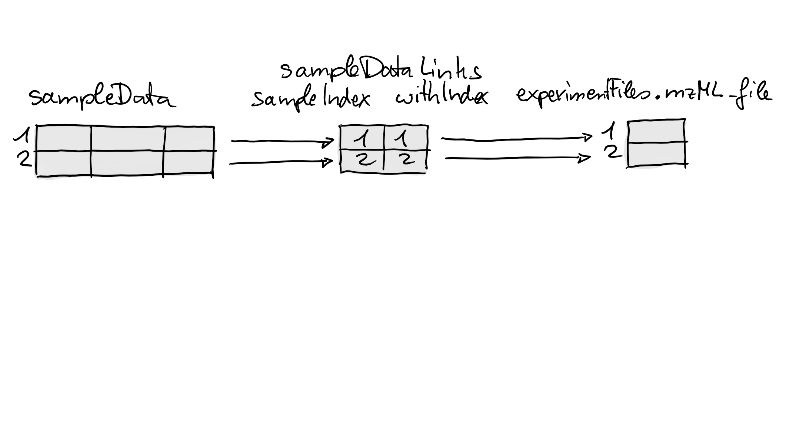
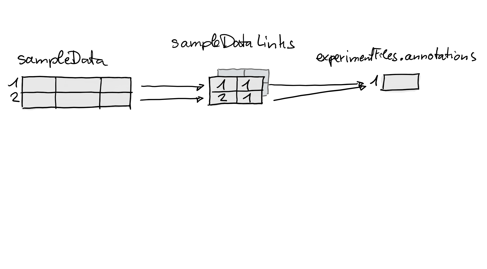

```{r style, echo = FALSE, results = 'asis', message=FALSE}
BiocStyle::markdown()
```

**Package**: `r Biocpkg("MsExperiment")`<br />
**Authors**: `r packageDescription("MsExperiment")[["Author"]] `<br />
**Last modified:** `r file.info("MsExperiment.Rmd")$mtime`<br />
**Compiled**: `r date()`

```{r, echo = FALSE, message = FALSE}
library(MsExperiment)
library(Spectra)
library(BiocStyle)
```

# Introduction

The goal of the `MsExperiment` package is the store and handle all
data related to a mass spectrometry experiment. In this vignette, we
will describe how to create a `MsExperiment` object and populate it
with various types of data.

```{r}
library("MsExperiment")
```

# Getting data

We will use a small subset of the
[PXD022816](https://www.ebi.ac.uk/pride/archive/projects/PXD022816)
project ([Morgenstern et
al. (2020)](https://doi.org/10.1021/acs.jproteome.0c00956)). The
acquisitions correspond to a Pierce Thermo HeLa digestion standard,
diluted to 50ng/uL with 97:3 + 0.1% formic acid, and acquired on a
QExactive instrument.

Below, we use the `r Biocpkg("rpx")` package to access the project
from the PRIDE repository, and download files of interest. Note that
these will automatically be cached in the `rpx` packages' cache
directory.

```{r, eval = FALSE}
library("rpx")
px <- PXDataset("PXD022816")
px
pxfiles(px)
```

The project provides the vendor raw files, the converted mzML files as
well as the identification mzid files. Let's download fractions 1 and
2 of the mzML files.

If you run these commands interactively and it's the first time you
use `pxget()`, you will be asked to create the `rpx` cache directory -
you can safelfy answer *yes*. The files will then be downloaded. Next
time you want to get the same files, they will be loaded automatically
from cache.

```{r, eval = FALSE}
(i <- grep(".+0[12].+mzML$", pxfiles(px), value = TRUE))
fls <- pxget(px, i)
fls
```

# Mass spectrometry experiment

Let's start by creating an empty `MsExperiment` object that we will
populate with different pieces of data as we proceed with the analysis
of our data.

```{r, eval = FALSE}
msexp <- MsExperiment()
msexp
```

## Experiment files

Let's now start with our MS experiment management by saving the
relevant files in a dedicated `MsExperimentFiles` object. In addition
to the mzML files, let's also assume we have the human proteomics
fasta file ready. Later, when loading the raw data into R, we will
refer directly to the files in this `MsExperimentFiles` object.

```{r, eval = FALSE}
msfls <- MsExperimentFiles(mzmls = fls,
                           fasta = "homo_sapiens.fasta")
msfls
```

Let's add these files to the main experiment management object:

```{r, eval = FALSE}
experimentFiles(msexp) <- msfls
msexp
```

## Experimental design

The `colData` slot is used to describe the overall experimental design
of the experiment. It can be used to link samples to the files that
are part of the experiment. There can be a one-to-one link between a
sample and a file, such as for example in label-free approaches, or
one-to-many, in labelled multiplexed approaches.

Here, we are simply going to use the `colData` slot to match the files
to their respective fractions:

```{r, eval = FALSE}
sampleData(msexp) <- DataFrame(mzmls = basename(experimentFiles(msexp)[["mzmls"]]),
                               fractions = 1:2)
sampleData(msexp)
```

## Raw data

We can now create a `Spectra` object containing the raw data stored in
the mzML files. If you are not familiar with the `Spectra` object,
please refer to the [package
vignettes](https://rformassspectrometry.github.io/Spectra/articles/Spectra.html).

```{r, eval = FALSE}
sp <- Spectra(experimentFiles(msexp)[["mzmls"]])
sp
```

We can now add this object to the main experiment management object:

```{r, eval = FALSE}
spectra(msexp) <- sp
msexp
```

## Third party applications

Let's now assume we want to search the spectra in our mzML files
against the `homo_sapiens.fasta` file. To do so, we would like to use
a search engine such as MSGF+, that is run using the command line and
generates mzid files.

The command to run MSGF+ would look like this (see the [manual
page](https://msgfplus.github.io/msgfplus/MSGFPlus.html) for details):

```
java -jar /path/to/MSGFPlus.jar \
     -s input.mzML \
     -o output.mzid
     -d proteins.fasta \
     -t 20ppm \ ## precursor mass tolerance
     -tda 1 \   ## search decoy database
     -m 0 \     ## fragmentation method as written in the spectrum or CID if no info
     -int 1     ## Orbitrap/FTICR/Lumos
```

We can easily build such a command for each of our input file:

```{r, eval = FALSE}
mzids <- sub("mzML", "mzid", basename(experimentFiles(msexp)[["mzmls"]]))
paste0("java -jar /path/to/MSGFPlus.jar",
       " -s ", experimentFiles(msexp)[["mzmls"]],
       " -o ", mzids,
       " -d ", experimentFiles(msexp)[["fasta"]],
       " -t 20ppm",
       " -m 0",
       " int 1")
```

Here, for the sake of time and portability, we will not actually run
MSGF+, but a simple shell script that will generate mzid files in a
temporary R directory.


```{r, eval = FALSE}
(output <- file.path(tempdir(), mzids))
cmd <- paste("touch", output)
cmd
```

The `cmd` variable holds the two commands to be run on the command
line that will generate the new files. We can run each of these
commands with the `system()` function.

```{r, eval = FALSE}
sapply(cmd, system)
```

Below, we add the names of the newly created files to our experiment:

```{r, eval = FALSE}
experimentFiles(msexp)[["mzids"]] <- mzids
experimentFiles(msexp)
msexp
```

We can also decide to store the commands that were used to generate
the mzid files in the experiment's metadata slot. Here, we use the
convention to name that metadata item `"mzmls_to_mzids"` to document
to input and output of these commands.

```{r, eval = FALSE}
metadata(msexp)[["mzmls_to_mzids"]] <- cmd
metadata(msexp)
```

Finally, the `existMsExperimentFiles()` can be used at any time to
check which of files that are associated with an experiment actually
exist:

```{r, eval = FALSE}
existMsExperimentFiles(msexp)
```

# Saving and reusing experiments

The `MsExperiment` object has been used to store files and data
pertaining to a mass spectrometry experiment. It is now possible to
save that object and reload it later to recover all data and metadata.


```{r, eval = FALSE}
saveRDS(msexp, "msexp.rda")
rm(list = ls())
```

```{r, eval = FALSE}
msexp <- readRDS("msexp.rda")
msexp
experimentFiles(msexp)
```

We can access the raw data as long as the mzML files that were used to
generate it still exist in their original location, which is the case
here as they were saved in the `rpx` cache directory.

```{r, eval = FALSE}
sp <- spectra(msexp)
sp
plotSpectra(sp[1000])
```


# Linking experimental data to samples

For some experiments and data analyses an explicit link between data, data files
and respective samples is required. Such links enable an easy (and error-free)
subsetting or re-ordering of a whole experiment by sample and would also
simplify coloring and labeling of the data depending on the sample or of its
variables or conditions.

Below we generate an `MsExperiment` object for a simple experiment consisting of
a single sample measured in two different injections to the same LC-MS setup.

```{r}
mse <- MsExperiment()
sd <- DataFrame(sample_id = c("QC1", "QC2"),
                sample_name = c("QC Pool", "QC Pool"),
                injection_idx = c(1, 3))
sampleData(mse) <- sd
```

We next add mzML files to the experiment for the sample that was measured. These
are available within the `msdata` R package. We add also an additional
*annotation* file `"internal_standards.txt"` to the experiment, which could be
e.g. a file with m/z and retention times of internal standards added to the
sample (note that such files don't necessarily have to exist).

```{r}
fls <- dir(system.file("sciex", package = "msdata"), full.names = TRUE)
basename(fls)

experimentFiles(mse) <- MsExperimentFiles(
    mzML_files = fls,
    annotations = "internal_standards.txt")
```

Next we load the MS data from the mzML files as a `Spectra` object and add them
to the experiment (see the vignette of the `r BiocStyle::Biocpkg("Spectra")` for
details on import and representation of MS data).

```{r}
sps <- Spectra(fls, backend = MsBackendMzR())
spectra(mse) <- sps
mse
```

At this stage we have thus sample annotations and MS data in our object, but no
explicit relationships between them. We next use the `linkSpectraData` function
to establish and define such relationships. First we link the experimental files
to the samples: we want to link the first mzML file in the element called
`"mzML_file"` in the object's `experimentFiles` to the first row in `sampleData`
and the second file to the second row.

```{r}
mse <- linkSampleData(mse, with = "experimentFiles.mzML_file",
                      sampleIndex = c(1, 2), withIndex = c(1, 2))
```

To define the link we have thus to specify with which *element* within our
`MsExperiment` we want to link samples. This can be done with the parameter
`with` that takes a single `character` representing the name (*address*) of the
data element. The name is a combination of the name of the slot within the
`MsExperiment` and the name of the element (or column) within that slot
separated by a `"."`. Using `with = "experimentFiles.mzML_file"` means we want
to link samples to values within the `"mzML_file"` element of the object's
`experimentFiles` slot - in other words, we want to link samples to values in
`experimentFiles(mse)$mzML_file`. The indices of the rows (samples) in
`sampleData` and the indices of the values in `with` to which we want to link
the samples can be defined with `sampleIndex` and `withIndex`. In the example
above we used `sampleIndex = c(1, 2)` and `withIndex = c(1, 2)`, thus, we want
to link the first row in `sampleData` to the first value in `with` and the
second row to the second value. See also the section *Linking sample data to
other experimental data* in the documentation of `MsExperiment` for more
information and details.

What happened internally by the call above is illustrated in the figure
below. The link is represented as a two-column integer `matrix` with the indices
of the linked sample in the first and the indices of the associated elements in
the second columns (this matrix is essentially a
`cbind(sampleIndex, withIndex)`).

```{r, echo = FALSE}

```

We next establish a second link between each sample and the *annotation*
file `"internal_standards.txt"` in `experimentFiles(mse)$standards`:

```{r}
mse <- linkSampleData(mse, with = "experimentFiles.annotations",
                      sampleIndex = c(1, 2), withIndex = c(1, 1))
```

The figure below illustrates again what happened internally by this call: a new
*link matrix* was added establishing the relationship between the two samples
and the one value in `experimentFiles(mse)$annotations`.

```{r, echo = FALSE}

```

It is thus also possible to link different samples to the same element. We next
link the spectra in the object to the individual samples. We use for that an
alternative way to specify the link without the need to provide `sampleIndex`
and `withIndex`. Sample-to-data links can also be specified using a syntax
similar to an SQL join:
`"sampleData.<column in sampleData> = <slot>.<element in slot>"`. Links will be
thus established between elements with matching values in the specified data
fields (i.e. between rows in `sampleData` for which values in the specified
column matches values in `<slot>.<element>`). In order to use this alternative
approach to link spectra to the respective samples we have to first add the
(full) raw file name as an additional column to the object's `sampleData`. We
can now add links between spectra and samples by matching this raw file name to
the original file name from which the spectra were imported (which is available
in the `"dataOrigin"` spectra variable).

```{r}
sampleData(mse)$raw_file <- normalizePath(fls)
mse <- linkSampleData(mse, with = "sampleData.raw_file = spectra.dataOrigin")
```

The link was thus established between matching values in
`sampleData(mse)$raw_file` and `spectra(mse)$dataOrigin`.

```{r}
sampleData(mse)$raw_file
head(spectra(mse)$dataOrigin)
```

The figure below illustrates this link. With that last call we have thus
established links between samples and 3 different data elements in
the `MsExperiment`.

```{r, echo = FALSE}
knitr::include_graphics("imgs/Links_03.png")
```

```{r}
mse
```

If we had also quantified *feature* values, we could also link them to the
samples. Below we create a simple, small `SummarizedExperiment` to represent
such quantified feature values and add that to our experiment. To show that
`MsExperiment` supports also links between subsets of data elements, we create a
`SummarizedExperiment` that contains values for an additional sample which is
not present in our `sampleData`. Also, we add samples in an arbitrary order.

```{r, message = FALSE}
library(SummarizedExperiment)
sd <- DataFrame(sample = c("QC2", "QC1", "QC3"), idx = c(3, 1, 5))
se <- SummarizedExperiment(colData = sd, assay = cbind(1:10, 11:20, 21:30))

mse@assay <- se
```

Next we link the samples in this `SummarizedExperiment` to the samples to in the
`MsExperiment` using matching values between the `"sample_id"` column in the
object's `sampleData` and the column `"sample"` in the `SummarizedExperiment`'s
`"sample"` variable.

```{r}
sampleData(mse)$sample_id
mse@assay$sample

mse <- linkSampleData(mse, with = "sampleData.sample_id = assay.sample")
mse
```

The main advantage of all these links is that any subsetting of the experiment
by sample will keep the (linked) data consistent. To illustrate this we subset
below the experiment to the second sample.

```{r}
b <- mse[, 2]
b
```

The subsetted object contains now all data elements that are linked to this
second sample. Accessing the `assay` of the `SummarizedExperiment` in
`assay` will thus return only the quantified feature abundances for this
second sample.

```{r}
assay(b@assay)
```

But what happens for data elements that are not linked to any sample? Below we
add a `data.frame` as a `metadata` to the experiment and subset the object
again.

```{r}
metadata(mse)$other <- data.frame(sample_name = c("study_1", "POOL", "study_2"),
                                  index = 1:3)
b <- mse[, 2]
metadata(b)
```

By default, any element which is **not** linked to a sample is retained. We next
link each sample to the second row in this data frame and subset the data again
to the second sample.

```{r}
mse <- linkSampleData(mse, with = "metadata.other",
                      sampleIndex = 1:2, withIndex = c(2, 2))
b <- mse[, 2]
metadata(b)
```

Subsetting thus retained only the row in the data frame for the linked
sample. Obviously it is also possible to subset to multiple samples, in
arbitrary order. Below we re-order our experiment.

```{r}
mse <- mse[, c(2, 1)]
sampleData(mse)
```

The sample order is thus reversed and also all other linked elements are
re-ordered accordingly, such as `"mzML_file"` in the object's `experimentFiles`.

```{r}
experimentFiles(mse)$mzML_file
```

It is however important to note, that subsetting will also *duplicate* elements
that are associated with multiple samples:

```{r}
experimentFiles(mse)$annotations
```

Thus, while we added a single *annotation* file to the data element
`"annotations"` in `experimentFiles`, after subsetting we ended up with two
identical files. This duplication of *n:m* relationships between
samples to elements does however not affect data consistency. A sample will
always be linked to the correct value/element.


# Session information

```{r si}
sessionInfo()
```
